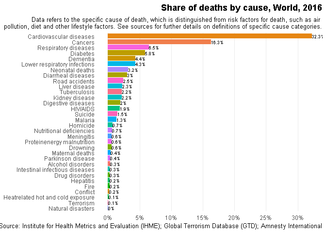

```r
library(readxl)
library(tidyverse)
owid <- read_excel("global_mortality.xlsx")

names(owid) <- str_trim(str_remove_all(names(owid), "[[:punct:]]"))
names(owid)[names(owid) == 'HIVAIDS'] = 'HIV/AIDS'
colnames(owid)[c(-1, -2, -3)] <- paste("rates", 
                                       colnames(owid[,c(-1, -2, -3)]),
                                       sep = ".")
owid %>% 
  as.data.frame %>% # if not, throws up error about renaming rows in tibbles
  reshape(timevar = 'disease', 
        varying = colnames(owid)[c(-1, -2, -3)], 
        direction = 'l') %>% na.omit -> a

rownames(a) <- NULL
```


```r
ggplot(a[a$country == 'World' & a$year == 2016,], 
       aes(x = reorder(disease, rates), y = rates, fill = disease)) + 
  geom_bar(stat = 'identity') + geom_text(aes(label = paste0(round(rates,1), '%')),
                                          position = position_dodge(width = .9), 
                                          hjust = "left", vjust = "center", size = 2.5)+
  coord_flip() +
  theme_minimal() + theme(legend.position = 'none', 
                          plot.title = element_text(hjust = 1, face = 'bold'), 
                          plot.subtitle = element_text(hjust = 1), 
                          axis.title.x=element_blank(), 
                          axis.title.y=element_blank(), 
                          panel.grid.major.y = element_blank(), 
                          panel.grid.minor = element_blank()) + 
  scale_y_continuous(breaks = c(0,5,10,15,20,25,30), 
                     labels = c('0%', '5%', '10%', '15%', '20%', '25%', '30%')) + 
  labs(title = 'Share of deaths by cause, World, 2016',
       subtitle = 'Data refers to the specific cause of death, which is distinguished from risk factors for death, such as air \npollution, diet and other lifestyle factors. See sources for further details on definitions of specific cause categories.',
       caption = 'Source: Institute for Health Metrics and Evaluation (IHME); Global Terrorism Database (GTD); Amnesty International') 
```

<!-- -->

```r
ggsave('owid.pdf')
```

```
## Saving 7 x 5 in image
```


```r
library(shiny)
ui <- fluidPage(
  titlePanel("Share of deaths by cause"),
  sidebarLayout(
    sidebarPanel(
      selectInput(inputId = "country", label = "Country:", choices = unique(owid$country), 
                  selected = "World"),
      
      sliderInput(inputId = "year", label = "Year:",
                  min = min(owid$year), max = max(owid$year),value = min(owid$year), 
                  animate = TRUE, sep = ""),
      p("Source: Institute for Health Metrics and Evaluation (IHME); Global Terrorism Database (GTD); Amnesty International")
    ),
    mainPanel(
        plotOutput(outputId = "barplot"),
        p("Data refers to the specific cause of death, which is distinguished from risk factors for death, such as air pollution, diet and other lifestyle factors. See sources for further details on definitions of specific cause categories.")
  )
  )
)


server <- function(input, output) {
  output$barplot <- renderPlot({
    ggplot(a[a$country == input$country & a$year == input$year & a$rates > 0,], 
           aes(x = reorder(disease, rates), y = rates, fill = disease)) + 
      geom_bar(stat = 'identity') + geom_text(aes(label = paste0(round(rates,1), '%')),
                                          position = position_dodge(width = .9), 
                                          hjust = "left", vjust = "center", size = 2.5)+
  coord_flip() +
  theme_minimal() + theme(legend.position = 'none', 
                          plot.title = element_text(hjust = 1), 
                          plot.subtitle = element_text(hjust = 1), 
                          axis.title.x=element_blank(), 
                          axis.title.y=element_blank(), 
                          panel.grid.major.y = element_blank(), 
                          panel.grid.minor = element_blank()) + 
  scale_y_continuous(breaks = c(0,5,10,15,20,25,30), 
                     labels = c('0%', '5%', '10%', '15%', '20%', '25%', '30%'))
  }
  )
}

shinyApp(ui = ui, server = server)
```

```
## PhantomJS not found. You can install it with webshot::install_phantomjs(). If it is installed, please make sure the phantomjs executable can be found via the PATH variable.
```

<!--html_preserve--><div style="width: 100% ; height: 400px ; text-align: center; box-sizing: border-box; -moz-box-sizing: border-box; -webkit-box-sizing: border-box;" class="muted well">Shiny applications not supported in static R Markdown documents</div><!--/html_preserve-->
[Link to Shiny document](https://philipk.shinyapps.io/Tidy3/)
