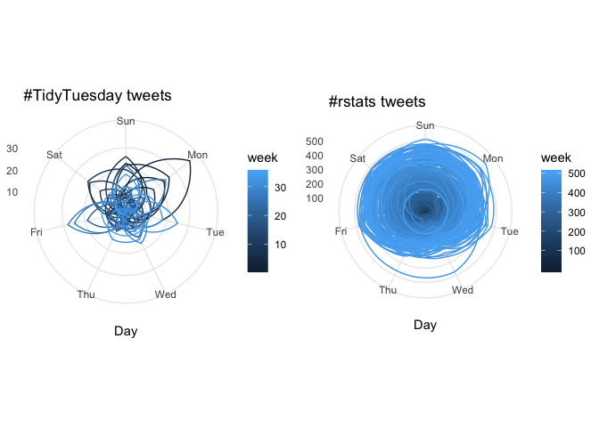
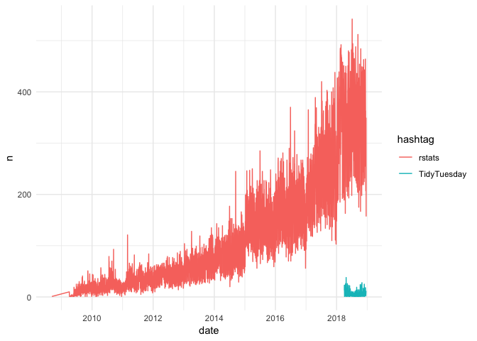
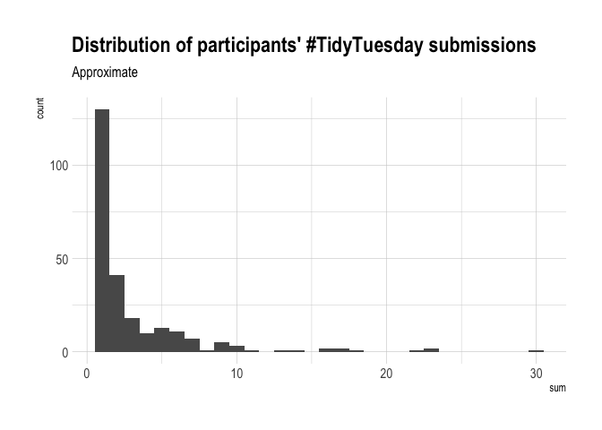
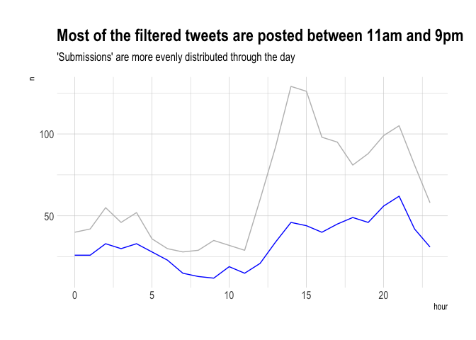

R Notebook
================

# Load the data

Generate a time series of counts of tweets

``` r
library(lubridate)
```

    ## 
    ## Attaching package: 'lubridate'

    ## The following object is masked from 'package:base':
    ## 
    ##     date

``` r
library(tsibble)
```

    ## 
    ## Attaching package: 'tsibble'

    ## The following objects are masked from 'package:lubridate':
    ## 
    ##     interval, new_interval

    ## The following object is masked from 'package:stats':
    ## 
    ##     filter

``` r
library(forecast)
library(tidyverse)
```

    ## ── Attaching packages ────────────────────────────────────────────────────────────── tidyverse 1.2.1 ──

    ## ✔ ggplot2 3.1.0     ✔ purrr   0.2.5
    ## ✔ tibble  1.4.2     ✔ dplyr   0.7.8
    ## ✔ tidyr   0.8.2     ✔ stringr 1.3.1
    ## ✔ readr   1.3.1     ✔ forcats 0.3.0

    ## ── Conflicts ───────────────────────────────────────────────────────────────── tidyverse_conflicts() ──
    ## ✖ lubridate::as.difftime() masks base::as.difftime()
    ## ✖ lubridate::date()        masks base::date()
    ## ✖ dplyr::filter()          masks tsibble::filter(), stats::filter()
    ## ✖ dplyr::id()              masks tsibble::id()
    ## ✖ lubridate::intersect()   masks base::intersect()
    ## ✖ tsibble::interval()      masks lubridate::interval()
    ## ✖ dplyr::lag()             masks stats::lag()
    ## ✖ tsibble::new_interval()  masks lubridate::new_interval()
    ## ✖ lubridate::setdiff()     masks base::setdiff()
    ## ✖ lubridate::union()       masks base::union()

``` r
library(cowplot)
```

    ## 
    ## Attaching package: 'cowplot'

    ## The following object is masked from 'package:ggplot2':
    ## 
    ##     ggsave

``` r
library(rlang)
```

    ## 
    ## Attaching package: 'rlang'

    ## The following objects are masked from 'package:purrr':
    ## 
    ##     %@%, %||%, as_function, flatten, flatten_chr, flatten_dbl,
    ##     flatten_int, flatten_lgl, invoke, list_along, modify, prepend,
    ##     rep_along, splice

``` r
library(magrittr)
```

    ## 
    ## Attaching package: 'magrittr'

    ## The following object is masked from 'package:rlang':
    ## 
    ##     set_names

    ## The following object is masked from 'package:purrr':
    ## 
    ##     set_names

    ## The following object is masked from 'package:tidyr':
    ## 
    ##     extract

``` r
library(glue)
```

    ## 
    ## Attaching package: 'glue'

    ## The following object is masked from 'package:dplyr':
    ## 
    ##     collapse

``` r
library(hrbrthemes)
```

    ## NOTE: Either Arial Narrow or Roboto Condensed fonts are *required* to use these themes.

    ##       Please use hrbrthemes::import_roboto_condensed() to install Roboto Condensed and

    ##       if Arial Narrow is not on your system, please see http://bit.ly/arialnarrow

``` r
library(here)
```

    ## here() starts at /Users/philip/tidytuesday-pk

    ## 
    ## Attaching package: 'here'

    ## The following object is masked from 'package:lubridate':
    ## 
    ##     here

# Create a time series of counts of tweets per day

  - Check for gaps using `tsibble`

<!-- end list -->

``` r
load_data <- function(x){
  glue("https://github.com/rfordatascience/tidytuesday/raw/master/data/2019/2019-01-01/{x}_tweets.rds") %>% 
  url(description = .) %>% 
  readRDS() %>% 
  list(ts = count(., date = round_date(created_at, "day")), 
       start_date = week(round_date(min(.$created_at), 
                                    unit = "week")))
}

ls_data <- map(c(TidyTuesday = "tidytuesday", 
              rstats = "rstats"), 
            load_data)

str(ls_data, max.level = 2)
```

    ## List of 2
    ##  $ TidyTuesday:List of 3
    ##   ..$           :Classes 'tbl_df', 'tbl' and 'data.frame':   1565 obs. of  88 variables:
    ##   ..$ ts        :Classes 'tbl_df', 'tbl' and 'data.frame':   239 obs. of  2 variables:
    ##   ..$ start_date: num 13
    ##  $ rstats     :List of 3
    ##   ..$           :Classes 'tbl_df', 'tbl' and 'data.frame':   429513 obs. of  88 variables:
    ##   ..$ ts        :Classes 'tbl_df', 'tbl' and 'data.frame':   3515 obs. of  2 variables:
    ##   ..$ start_date: num 36

# Check for gaps in the time series

``` r
check_for_gaps <- . %>% 
  pluck(2) %>% 
  mutate(date = as_date(date)) %>% 
  as_tsibble(regular = TRUE) %>% 
  count_gaps(.full = TRUE)

map_df(ls_data, check_for_gaps, .id = "hashtag")
```

    ## Column `date` is the index.

    ## Warning: `list_len()` is soft-deprecated as of rlang 0.2.0.
    ## Please use `new_list()` instead
    ## This warning is displayed once per session.

    ## Column `date` is the index.

    ## # A tibble: 30 x 4
    ##    hashtag     .from      .to           .n
    ##    <chr>       <date>     <date>     <int>
    ##  1 TidyTuesday 2018-05-06 2018-05-06     1
    ##  2 TidyTuesday 2018-05-20 2018-05-20     1
    ##  3 TidyTuesday 2018-06-17 2018-06-17     1
    ##  4 TidyTuesday 2018-07-08 2018-07-08     1
    ##  5 TidyTuesday 2018-07-27 2018-07-29     3
    ##  6 TidyTuesday 2018-08-18 2018-08-18     1
    ##  7 TidyTuesday 2018-08-26 2018-08-27     2
    ##  8 TidyTuesday 2018-09-01 2018-09-01     1
    ##  9 TidyTuesday 2018-09-08 2018-09-08     1
    ## 10 TidyTuesday 2018-09-29 2018-09-29     1
    ## # ... with 20 more rows

``` r
# fill gaps with 0s
filling_gaps <- function(x){ 
  x[[2]] <- x[[2]] %>% 
    mutate(date = as_date(date)) %>%
    as_tsibble(regular = TRUE) %>% 
    fill_gaps(n = 0L) 
  return(x)
}
data <- map(ls_data, filling_gaps) 
```

    ## Column `date` is the index.
    ## Column `date` is the index.

``` r
# start at first day of week
polar_plot <- function(.x, .y) {
  .x$ts %>% 
    pull(n) %>% 
    ts(frequency = 7, start = c(1, .x$created_at)) %>% 
    ggseasonplot(main = glue("#{.y} tweets"), 
                 continuous = TRUE, 
                 polar = TRUE) + theme_minimal() + 
    labs(color = "week")
}

map2(ls_data, names(ls_data), polar_plot) %>% 
  plot_grid(plotlist = .)
```

<!-- -->

# Count of tweets over time

``` r
str(ls_data, max.level = 2)
```

    ## List of 2
    ##  $ TidyTuesday:List of 3
    ##   ..$           :Classes 'tbl_df', 'tbl' and 'data.frame':   1565 obs. of  88 variables:
    ##   ..$ ts        :Classes 'tbl_df', 'tbl' and 'data.frame':   239 obs. of  2 variables:
    ##   ..$ start_date: num 13
    ##  $ rstats     :List of 3
    ##   ..$           :Classes 'tbl_df', 'tbl' and 'data.frame':   429513 obs. of  88 variables:
    ##   ..$ ts        :Classes 'tbl_df', 'tbl' and 'data.frame':   3515 obs. of  2 variables:
    ##   ..$ start_date: num 36

``` r
bind_rows(ls_data$TidyTuesday[[2]], ls_data$rstats[[2]], .id = "hashtag") %>% 
  mutate(hashtag = case_when(hashtag == 1 ~ "TidyTuesday", 
                             TRUE ~ "rstats")) %>% 
  ggplot(aes(x = date, y = n, color = hashtag)) + geom_line() + theme_minimal()
```

<!-- -->

# Manual random check on suspicious looking screen names

Some are cleaning services, city councils/community volunteers, social
media influencers sharing tweets on how to be tidy, and community R
accounts that are unlikely to amount to user submissions. I manually
look up some screen names to be sure.

To filter for user submissions, I use the following (rather crude)
rules:

  - People posting from the [Buffer](https://buffer.com/) app are
    filtered out. Buffer is a social media management app - it’s
    unlikely that participants are posting from
Buffer.

<!-- end list -->

``` r
communities <- c("RLadiesELansing", "PodsProgram", "WeAreRLadies", "RLadiesLondon", "R4DScommunity",  "thomas_mock"
                 )
others <- c("AirdrieExchange", "tidyyourworld", "SavvySpaceSolut", "emfriesen", "stevie_t13", "EjayOnline",
            "worldcattitude", "SummitAppliance", "BellaBooDC", "RouteMediaUK", "London__Digital", 
            "AdoptionsWLove", "_Mindmassage", "_VictoriaPlace", "BonnieC919", "EnglishHomeTeam", "fakrogb", "town_of_pc", 
            "racinggreenmids", "FitKitchens", "GlowExpressWash", "GlitterOnADime", "HomerHelper", "leafinnovations",
            "LivingSimplyLR", "BooksForOrphans", "BishopSport", "BroomsInBloom", "CDSChester", "CMwaste2007", 
            "CountrywithKim", "PMPUtilities", "Sarah_C_Church", "SugarLesswithC", "SportandiAndres",
            "Shortie_Amazing", "silicasun", "sirfrancishill", "steph4smith", "rubyslifestyle", 
            "PinkGiraffe_", "RogersUptown", "OrganisedWell", "StanleyWingHK", "RGTB", "OrganisingNinja", 
            "naturalstclean", "Nightingale_NTA", "PurfectSoluxion", "SimsLifeBlog", "ThomsonPlumbing")
screen_filter <- c(communities, others)

tidied <- ls_data$TidyTuesday[[1]] %>% 
  unnest(media_type) %>% 
  mutate(week = ymd("2018-04-02") %--% as_date(created_at)/dweeks(1), 
         source_filter = !((screen_name %in% screen_filter)  | (source == "Buffer")),
         
         # does help that most participants properly thread their submissions 
         # so it's unlikely we get a submission that's a reply to another tweet
         # we want to count each participant once anyway, so ...
         reply_filter = is.na(reply_to_screen_name),
         
         # this would (hopefully) remove most tweets discussing the project
         # in favour of **actual** submissions
         photos_only = media_type %in% "photo") 
```

# Compiling a leaderboard

From this we can compile a leaderboard on who makes the most
\#TidyTuesday submissions.

``` r
leaderboard <- tidied %>% 
  filter(source_filter & reply_filter & photos_only) %>% 
  count(screen_name, week) %>% 
  rename(tweets = n ) %>% 
  mutate(tweets = na_if(x = tweets, y = 0)) %>% # treat weeks where 0 as NAs 
  # average of 0s not useful here
  group_by(screen_name) %>% 
  summarise(min = min(tweets, na.rm = TRUE), 
            max = max(tweets, na.rm = TRUE), 
            mean = mean(tweets, na.rm = TRUE), 
            sum = sum(tweets, na.rm = TRUE)) %>% 
  arrange(desc(sum)) 

head(leaderboard, 10) %>% 
  select(screen_name, sum) %>% 
  knitr::kable()
```

| screen\_name    | sum |
| :-------------- | --: |
| harrocyranka    |  30 |
| sapo83          |  23 |
| WireMonkey      |  23 |
| veerlevanson    |  22 |
| htoscano84      |  18 |
| committedtotape |  17 |
| DaveBloom11     |  17 |
| othomn          |  16 |
| parttimeanalyst |  16 |
| kigtembu        |  14 |

## Save and visualise the leaderboard

``` r
write_csv(leaderboard, path = here::here("2019", "w1_2019", "data", "tt_leaderboard.csv"))

ggplot(leaderboard, aes(x = sum)) + 
  geom_histogram() + 
  labs(title = "Distribution of participants' #TidyTuesday submissions", 
       subtitle = "Approximate") + theme_ipsum()
```

    ## `stat_bin()` using `bins = 30`. Pick better value with `binwidth`.

<!-- -->

``` r
tidied_ts <- tidied %>% 
  filter(source_filter & reply_filter & photos_only) %>% 
  count(date = round_date(created_at, "day")) %>% 
  mutate(id = "id", 
         date = as_date(date)) %>%
  as_tsibble(key = id(id), index = date, regular = TRUE) 

tidied_ts %>% 
  count_gaps()
```

    ## # A tibble: 42 x 4
    ##    id    .from      .to           .n
    ##    <chr> <date>     <date>     <int>
    ##  1 id    2018-04-06 2018-04-06     1
    ##  2 id    2018-04-09 2018-04-09     1
    ##  3 id    2018-04-13 2018-04-13     1
    ##  4 id    2018-04-15 2018-04-15     1
    ##  5 id    2018-04-23 2018-04-23     1
    ##  6 id    2018-04-28 2018-04-28     1
    ##  7 id    2018-05-05 2018-05-06     2
    ##  8 id    2018-05-13 2018-05-13     1
    ##  9 id    2018-05-20 2018-05-20     1
    ## 10 id    2018-05-26 2018-05-26     1
    ## # ... with 32 more rows

``` r
tidied_ts %>% 
  fill_gaps(n = 0L) %>% 
  pull(n) %>% 
  ts(frequency = 7, start = c(1, 3)) %>% 
  ggseasonplot(main = "#TidyTuesday 'submissions'", 
               continuous = TRUE, polar = TRUE) + 
  labs(color = "week", 
       subtitle = "Most Twitter #TidyTuesday 'submissions' occur on Tue and Wed", 
       caption = "Submissions defined as tweets containing photos that are not replies to other tweets. \
       Tweets posted by non-R users, via the Buffer app and R community accounts excluded.") +
  theme_minimal()
```

<!-- -->

This contrasts with the conclusion we made at the start. If we had not
filtered for submissions, we may have been misled into thiking that most
people post their \#TidyTuesday work at the end of the week, and even on
Mondays.

``` r
count_hourly_tweets <- . %>% 
  mutate(date = round_date(created_at, unit = "hour")) %>% 
  group_by(date) %>% 
  summarise(n = n()) %>% 
  as_tsibble(index = date, regular = TRUE) %>% 
  fill_gaps(n = 0L) %>% 
  index_by(hour = hour(date)) %>%
  summarise(n = sum(n))

all_tt <- tidied %>% count_hourly_tweets()

filtered_tt <- tidied %>% 
  filter(source_filter & reply_filter & photos_only) %>%
  count_hourly_tweets()

ggplot() + geom_line(all_tt, mapping = aes(x = hour, y = n), color = 'grey') + 
  geom_line(filtered_tt, mapping = aes(x = hour, y = n), color = 'blue') + 
  labs(title = "Most of the filtered tweets are posted between 11am and 9pm", 
       subtitle = "'Submissions' are more evenly distributed through the day") + 
  theme_ipsum()
```

<!-- -->
