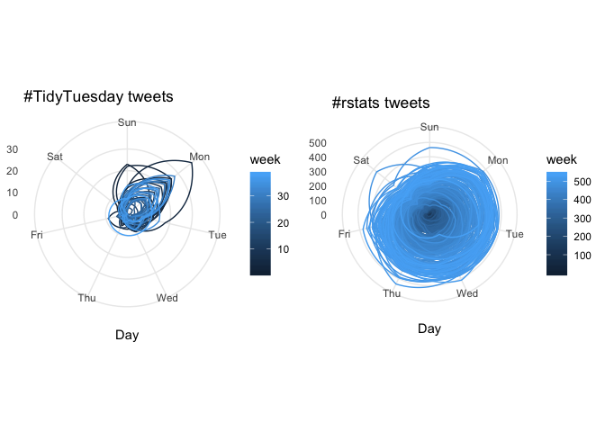
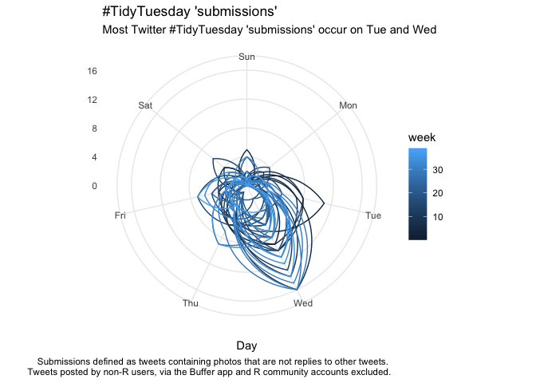
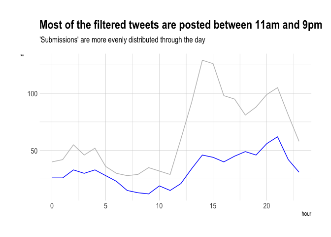

R Notebook
================

# Load the data

Generate a time series of counts of tweets

``` r
library(lubridate)
library(tsibble)
library(forecast)
library(tidyverse)
library(cowplot)
library(rlang)
library(magrittr)
library(glue)
library(hrbrthemes)
library(here)
```

# Create a time series of counts of tweets per day

Load the data as a list of lists:

  - one element for \#TidyTuesday and \#rstats
  - within each, three elements:
      - the data frame of tweets from `rtweet`, loaded from `readRDS()`
      - a tibble containing the counts of tweets on each date
      - a third element indicating the start date (for creating `ts`
        object)

<!-- end list -->

``` r
load_data <- function(x){
  glue("https://github.com/rfordatascience/tidytuesday/raw/master/data/2019/2019-01-01/{x}_tweets.rds") %>% 
  url(description = .) %>% 
  readRDS() %>% 
  list(ts = count(., date = round_date(created_at, "day")), 
       start_date = week(round_date(min(.$created_at), 
                                    unit = "week")))
}

ls_data <- map(c(TidyTuesday = "tidytuesday", 
              rstats = "rstats"), 
            load_data)

str(ls_data, max.level = 2)
```

    ## List of 2
    ##  $ TidyTuesday:List of 3
    ##   ..$           :Classes 'tbl_df', 'tbl' and 'data.frame':   1565 obs. of  88 variables:
    ##   ..$ ts        :Classes 'tbl_df', 'tbl' and 'data.frame':   239 obs. of  2 variables:
    ##   ..$ start_date: num 13
    ##  $ rstats     :List of 3
    ##   ..$           :Classes 'tbl_df', 'tbl' and 'data.frame':   429513 obs. of  88 variables:
    ##   ..$ ts        :Classes 'tbl_df', 'tbl' and 'data.frame':   3515 obs. of  2 variables:
    ##   ..$ start_date: num 36

# Check for gaps in the time series

There could be dates with no tweets. Use the `tsibble` package to check
for (`count_gaps`) and fill gaps (`fill_gaps`) in the time series.
Naturally, if the value is not available, the number of counts for a day
is 0.

``` r
check_for_gaps <- . %>% 
  pluck(2) %>% 
  mutate(date = as_date(date)) %>% 
  as_tsibble(regular = TRUE) %>% 
  count_gaps(.full = TRUE)

map_df(ls_data, check_for_gaps, .id = "hashtag") %>% 
  knitr::kable()
```

    ## Column `date` is the index.

    ## Warning: `list_len()` is soft-deprecated as of rlang 0.2.0.
    ## Please use `new_list()` instead
    ## This warning is displayed once per session.

    ## Column `date` is the index.

| hashtag     | .from      | .to        |  .n |
| :---------- | :--------- | :--------- | --: |
| TidyTuesday | 2018-05-06 | 2018-05-06 |   1 |
| TidyTuesday | 2018-05-20 | 2018-05-20 |   1 |
| TidyTuesday | 2018-06-17 | 2018-06-17 |   1 |
| TidyTuesday | 2018-07-08 | 2018-07-08 |   1 |
| TidyTuesday | 2018-07-27 | 2018-07-29 |   3 |
| TidyTuesday | 2018-08-18 | 2018-08-18 |   1 |
| TidyTuesday | 2018-08-26 | 2018-08-27 |   2 |
| TidyTuesday | 2018-09-01 | 2018-09-01 |   1 |
| TidyTuesday | 2018-09-08 | 2018-09-08 |   1 |
| TidyTuesday | 2018-09-29 | 2018-09-29 |   1 |
| TidyTuesday | 2018-10-08 | 2018-10-08 |   1 |
| TidyTuesday | 2018-10-14 | 2018-10-14 |   1 |
| TidyTuesday | 2018-10-21 | 2018-10-22 |   2 |
| TidyTuesday | 2018-11-02 | 2018-11-02 |   1 |
| TidyTuesday | 2018-11-04 | 2018-11-04 |   1 |
| TidyTuesday | 2018-11-26 | 2018-11-26 |   1 |
| TidyTuesday | 2018-12-09 | 2018-12-10 |   2 |
| rstats      | 2008-09-09 | 2009-04-03 | 207 |
| rstats      | 2009-04-07 | 2009-04-07 |   1 |
| rstats      | 2009-04-11 | 2009-04-20 |  10 |
| rstats      | 2009-04-27 | 2009-04-28 |   2 |
| rstats      | 2009-04-30 | 2009-05-05 |   6 |
| rstats      | 2009-05-08 | 2009-05-08 |   1 |
| rstats      | 2009-05-10 | 2009-05-11 |   2 |
| rstats      | 2009-05-14 | 2009-05-14 |   1 |
| rstats      | 2009-05-16 | 2009-05-20 |   5 |
| rstats      | 2009-05-22 | 2009-05-22 |   1 |
| rstats      | 2009-05-24 | 2009-05-26 |   3 |
| rstats      | 2009-06-28 | 2009-06-28 |   1 |
| rstats      | 2009-11-28 | 2009-11-28 |   1 |

``` r
# fill gaps with 0s
filling_gaps <- function(x){ 
  x[[2]] <- x[[2]] %>% 
    mutate(date = as_date(date)) %>%
    as_tsibble(regular = TRUE) %>% 
    fill_gaps(n = 0L) 
  return(x)
}
data <- map(ls_data, filling_gaps) 
```

    ## Column `date` is the index.
    ## Column `date` is the index.

``` r
# start at first day of week
polar_plot <- function(.x, .y) {
  .x$ts %>% 
    pull(n) %>% 
    ts(frequency = 7, start = c(1, .x$created_at)) %>% 
    ggseasonplot(main = glue("#{.y} tweets"), 
                 continuous = TRUE, 
                 polar = TRUE) + theme_minimal() + 
    labs(color = "week")
}

map2(ls_data, names(ls_data), polar_plot) %>% 
  plot_grid(plotlist = .)
```

<!-- -->

# Count of tweets over time

``` r
str(ls_data, max.level = 2)
```

    ## List of 2
    ##  $ TidyTuesday:List of 3
    ##   ..$           :Classes 'tbl_df', 'tbl' and 'data.frame':   1565 obs. of  88 variables:
    ##   ..$ ts        :Classes 'tbl_df', 'tbl' and 'data.frame':   239 obs. of  2 variables:
    ##   ..$ start_date: num 13
    ##  $ rstats     :List of 3
    ##   ..$           :Classes 'tbl_df', 'tbl' and 'data.frame':   429513 obs. of  88 variables:
    ##   ..$ ts        :Classes 'tbl_df', 'tbl' and 'data.frame':   3515 obs. of  2 variables:
    ##   ..$ start_date: num 36

After filling in the gaps in the data frames with 0s, we can visualise
how the number of tweets evolves for each of these hashtags over
time:

``` r
bind_rows(ls_data$TidyTuesday[[2]], ls_data$rstats[[2]], .id = "hashtag") %>% 
  mutate(hashtag = case_when(hashtag == 1 ~ "TidyTuesday", 
                             TRUE ~ "rstats")) %>% 
  ggplot(aes(x = date, y = n, color = hashtag)) + geom_line() + theme_minimal()
```

<!-- -->

# Manual (not-really-)random check on suspicious looking screen names

Some are cleaning services, city councils/community volunteers, social
media influencers sharing tweets on how to be tidy, and community R
accounts that are unlikely to amount to user submissions. I manually
look up some screen names to be sure, although I haven’t had an
exhaustive check. This leaves me with around 255 \#TidyTuesday
participants in this dataset.

To filter for user submissions, I use the following (rather crude)
rules:

  - People posting from the [Buffer](https://buffer.com/) app are
    filtered out. Buffer is a social media management app - it’s
    unlikely that participants are posting from Buffer.
  - Filtering out replies: most participants properly thread their
    submissions so it’s unlikely we get a submission that’s a reply to
    another tweet. We want to count each participant once anyway, so …
  - Filtering out posts that don’t contain photos: \#TidyTuesday focuses
    on visualisation, so participants will naturally want to highlight
    the charts they’ve made. Filtering these tweets would (hopefully)
    remove most tweets discussing the project in favour of **actual**
    submissions.

<!-- end list -->

``` r
communities <- c("RLadiesELansing", "PodsProgram", "WeAreRLadies", "RLadiesLondon", "R4DScommunity",  "thomas_mock"
                 )
others <- c("AirdrieExchange", "tidyyourworld", "SavvySpaceSolut", "emfriesen",
            "stevie_t13", "EjayOnline", "worldcattitude", "SummitAppliance",
            "BellaBooDC", "RouteMediaUK", "London__Digital", "AdoptionsWLove",
            "_Mindmassage", "_VictoriaPlace", "BonnieC919", "EnglishHomeTeam",
            "fakrogb", "town_of_pc", "racinggreenmids", "FitKitchens",
            "GlowExpressWash", "GlitterOnADime", "HomerHelper", "leafinnovations",
            "LivingSimplyLR", "BooksForOrphans", "BishopSport", "BroomsInBloom",
            "CDSChester", "CMwaste2007", "CountrywithKim", "PMPUtilities",
            "Sarah_C_Church", "SugarLesswithC", "SportandiAndres", 
            "Shortie_Amazing", "silicasun", "sirfrancishill", "steph4smith",
            "rubyslifestyle","PinkGiraffe_", "RogersUptown", "OrganisedWell",
            "StanleyWingHK", "RGTB", "OrganisingNinja","naturalstclean",
            "Nightingale_NTA", "PurfectSoluxion", "SimsLifeBlog",
            "ThomsonPlumbing")

screen_filter <- c(communities, others)

tidied <- ls_data$TidyTuesday[[1]] %>% 
  unnest(media_type) %>% 
  mutate(week = ymd("2018-04-02") %--% as_date(created_at)/dweeks(1), 
         source_filter = !((screen_name %in% screen_filter)  | (source == "Buffer")),
         reply_filter = is.na(reply_to_screen_name),
         photos_only = media_type %in% "photo") 
```

# Compiling a leaderboard

From this we can compile a leaderboard on who makes the most
\#TidyTuesday submissions.

``` r
leaderboard <- tidied %>% 
  filter(source_filter & reply_filter & photos_only) %>% 
  count(screen_name, week) %>% 
  rename(tweets = n ) %>% 
  mutate(tweets = na_if(x = tweets, y = 0)) %>% # treat weeks where 0 as NAs 
  # average of 0s not useful here
  group_by(screen_name) %>% 
  summarise(min = min(tweets, na.rm = TRUE), 
            max = max(tweets, na.rm = TRUE), 
            mean = mean(tweets, na.rm = TRUE), 
            sum = sum(tweets, na.rm = TRUE)) %>% 
  arrange(desc(sum)) 

head(leaderboard, 10) %>% 
  select(screen_name, sum) %>% 
  knitr::kable()
```

| screen\_name    | sum |
| :-------------- | --: |
| harrocyranka    |  30 |
| sapo83          |  23 |
| WireMonkey      |  23 |
| veerlevanson    |  22 |
| htoscano84      |  18 |
| committedtotape |  17 |
| DaveBloom11     |  17 |
| othomn          |  16 |
| parttimeanalyst |  16 |
| kigtembu        |  14 |

## Save and visualise the leaderboard

``` r
write_csv(leaderboard %>% select(screen_name, sum),
          path = here::here("2019", "w1_2019", "data", "tt_leaderboard.csv"))

ggplot(leaderboard, aes(x = sum)) + 
  geom_histogram() + 
  labs(title = "Distribution of participants' #TidyTuesday submissions", 
       subtitle = "Approximate") + theme_ipsum()
```

    ## `stat_bin()` using `bins = 30`. Pick better value with `binwidth`.

<!-- -->

``` r
tidied_ts <- tidied %>% 
  filter(source_filter & reply_filter & photos_only) %>% 
  count(date = round_date(created_at, "day")) %>% 
  mutate(id = "id", 
         date = as_date(date)) %>%
  as_tsibble(key = id(id), index = date, regular = TRUE) 

tidied_ts %>% 
  count_gaps() %>% 
  knitr::kable()
```

| id | .from      | .to        | .n |
| :- | :--------- | :--------- | -: |
| id | 2018-04-06 | 2018-04-06 |  1 |
| id | 2018-04-09 | 2018-04-09 |  1 |
| id | 2018-04-13 | 2018-04-13 |  1 |
| id | 2018-04-15 | 2018-04-15 |  1 |
| id | 2018-04-23 | 2018-04-23 |  1 |
| id | 2018-04-28 | 2018-04-28 |  1 |
| id | 2018-05-05 | 2018-05-06 |  2 |
| id | 2018-05-13 | 2018-05-13 |  1 |
| id | 2018-05-20 | 2018-05-20 |  1 |
| id | 2018-05-26 | 2018-05-26 |  1 |
| id | 2018-05-28 | 2018-05-28 |  1 |
| id | 2018-06-04 | 2018-06-04 |  1 |
| id | 2018-06-09 | 2018-06-09 |  1 |
| id | 2018-06-17 | 2018-06-17 |  1 |
| id | 2018-07-01 | 2018-07-01 |  1 |
| id | 2018-07-08 | 2018-07-08 |  1 |
| id | 2018-07-14 | 2018-07-14 |  1 |
| id | 2018-07-17 | 2018-07-17 |  1 |
| id | 2018-07-21 | 2018-07-30 | 10 |
| id | 2018-08-11 | 2018-08-11 |  1 |
| id | 2018-08-18 | 2018-08-19 |  2 |
| id | 2018-08-26 | 2018-08-27 |  2 |
| id | 2018-08-31 | 2018-09-01 |  2 |
| id | 2018-09-04 | 2018-09-04 |  1 |
| id | 2018-09-08 | 2018-09-08 |  1 |
| id | 2018-09-17 | 2018-09-17 |  1 |
| id | 2018-09-22 | 2018-09-22 |  1 |
| id | 2018-09-25 | 2018-09-25 |  1 |
| id | 2018-09-29 | 2018-09-29 |  1 |
| id | 2018-10-02 | 2018-10-02 |  1 |
| id | 2018-10-07 | 2018-10-09 |  3 |
| id | 2018-10-13 | 2018-10-15 |  3 |
| id | 2018-10-21 | 2018-10-22 |  2 |
| id | 2018-11-02 | 2018-11-02 |  1 |
| id | 2018-11-04 | 2018-11-04 |  1 |
| id | 2018-11-06 | 2018-11-06 |  1 |
| id | 2018-11-19 | 2018-11-19 |  1 |
| id | 2018-11-24 | 2018-11-24 |  1 |
| id | 2018-11-26 | 2018-11-27 |  2 |
| id | 2018-12-01 | 2018-12-01 |  1 |
| id | 2018-12-03 | 2018-12-03 |  1 |
| id | 2018-12-09 | 2018-12-10 |  2 |

``` r
tidied_ts %>% 
  fill_gaps(n = 0L) %>% 
  pull(n) %>% 
  ts(frequency = 7, start = c(1, 3)) %>% 
  ggseasonplot(main = "#TidyTuesday 'submissions'", 
               continuous = TRUE, polar = TRUE) + 
  labs(color = "week", 
       subtitle = "Most Twitter #TidyTuesday 'submissions' occur on Tue and Wed", 
       caption = "Submissions defined as tweets containing photos that are not replies to other tweets. \
       Tweets posted by non-R users, via the Buffer app and R community accounts excluded.") +
  theme_minimal()
```

<!-- -->

This contrasts with the conclusion we made at the start. If we had not
filtered for submissions, we may have been misled into thiking that most
people post their \#TidyTuesday work at the end of the week, and even on
Mondays.

``` r
count_hourly_tweets <- . %>% 
  mutate(date = round_date(created_at, unit = "hour")) %>% 
  group_by(date) %>% 
  summarise(n = n()) %>% 
  as_tsibble(index = date, regular = TRUE) %>% 
  fill_gaps(n = 0L) %>% 
  index_by(hour = hour(date)) %>%
  summarise(n = sum(n))

all_tt <- tidied %>% count_hourly_tweets()

filtered_tt <- tidied %>% 
  filter(source_filter & reply_filter & photos_only) %>%
  count_hourly_tweets()

ggplot() + geom_line(all_tt, mapping = aes(x = hour, y = n), color = 'grey') + 
  geom_line(filtered_tt, mapping = aes(x = hour, y = n), color = 'blue') + 
  labs(title = "Most of the filtered tweets are posted between 11am and 9pm", 
       subtitle = "'Submissions' are more evenly distributed through the day") + 
  theme_ipsum()
```

<!-- -->
