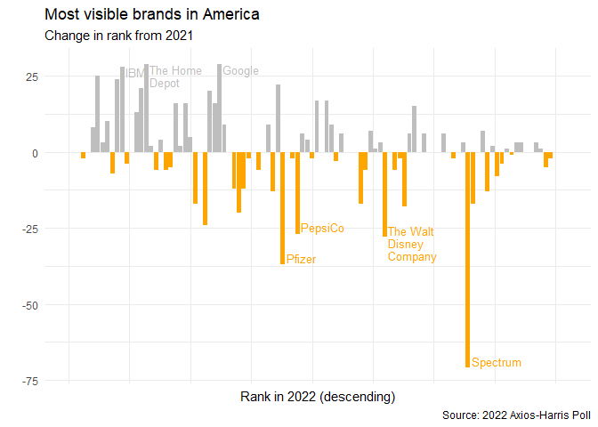
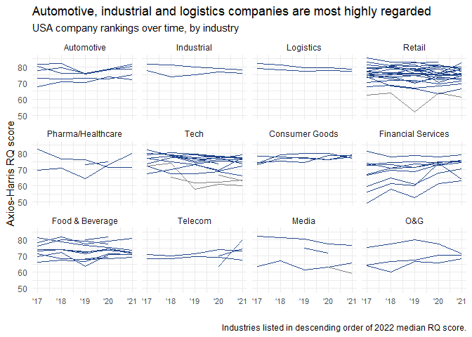
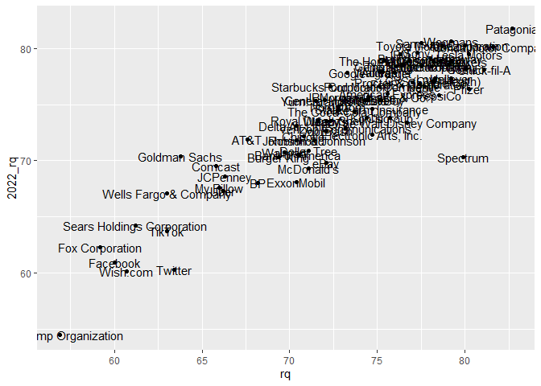
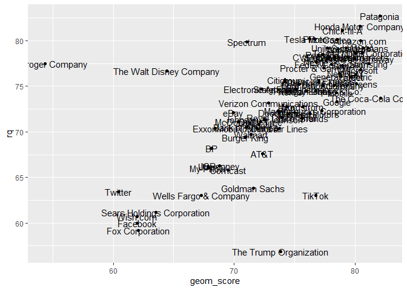

2022 Axios-Harris Poll
================

``` r
library(dplyr)
```


    Attaching package: 'dplyr'

    The following objects are masked from 'package:stats':

        filter, lag

    The following objects are masked from 'package:base':

        intersect, setdiff, setequal, union

``` r
library(ggplot2)

tuesdata <- tidytuesdayR::tt_load(2022, week = 22)
```

    --- Compiling #TidyTuesday Information for 2022-05-31 ----

    --- There are 2 files available ---

    --- Starting Download ---


        Downloading file 1 of 2: `reputation.csv`
        Downloading file 2 of 2: `poll.csv`

    --- Download complete ---

``` r
poll <- tuesdata$poll
```

``` r
poll 
```

    # A tibble: 500 × 8
       company      industry `2022_rank` `2022_rq` change  year  rank    rq
       <chr>        <chr>          <dbl>     <dbl>  <dbl> <dbl> <dbl> <dbl>
     1 Trader Joe's Retail             1      82.4     NA  2017    NA  NA  
     2 Trader Joe's Retail             1      82.4     NA  2018    NA  NA  
     3 Trader Joe's Retail             1      82.4     NA  2019    NA  78.2
     4 Trader Joe's Retail             1      82.4     NA  2020    NA  80.7
     5 Trader Joe's Retail             1      82.4     NA  2021    NA  NA  
     6 HEB Grocery  Retail             2      82       NA  2017    NA  NA  
     7 HEB Grocery  Retail             2      82       NA  2018    NA  81.1
     8 HEB Grocery  Retail             2      82       NA  2019    NA  82.5
     9 HEB Grocery  Retail             2      82       NA  2020    NA  83.1
    10 HEB Grocery  Retail             2      82       NA  2021    NA  NA  
    # … with 490 more rows

``` r
poll |> 
  distinct(company, industry) |> 
  count(company) |> 
  count(n)
```

    Storing counts in `nn`, as `n` already present in input
    ℹ Use `name = "new_name"` to pick a new name.

    # A tibble: 1 × 2
          n    nn
      <int> <int>
    1     1   100

``` r
poll |> 
  distinct(company, change) |> 
  count(change)
```

    # A tibble: 41 × 2
       change     n
        <dbl> <int>
     1    -71     1
     2    -37     1
     3    -28     1
     4    -27     1
     5    -24     1
     6    -20     1
     7    -18     1
     8    -17     3
     9    -13     2
    10    -12     2
    # … with 31 more rows

``` r
poll |> 
  distinct(company, `2022_rank`, change) |> 
  mutate(
    change = ifelse(is.na(change), 0, change),
    col = ifelse(change > 0, 0, -1), 
    top_cos = ifelse(change > 25 | change < -25,
                     stringr::str_wrap(company, width = 10),
                     "")
  ) |> 
  ggplot(aes(x = `2022_rank`, y = change, fill = factor(col))) + 
  geom_col() + 
  scale_fill_discrete(type = c(`-1` = "orange", `0` = "grey")) + 
  scale_colour_discrete(type = c(`-1` = "orange", `0` = "grey")) + 
  geom_text(
    aes(
      label = top_cos,
      x = `2022_rank` + .7,
      colour = factor(col),
      y = ifelse(change > 0, change, change + 4)),
    position = position_dodge(width = 3),
    hjust = 0, 
    vjust = 1, 
    # colour = "grey50", 
    size = 3.5, 
    lineheight = .9
  ) +
  guides(fill = "none", colour = "none") + 
  theme_minimal() + 
  theme(axis.text.x = element_blank()) + 
  labs(
    x = "Rank in 2022 (descending)", 
    y = "",
    title = "Most visible brands in America",
    subtitle = "Change in rank from 2021", 
    caption = "Source: 2022 Axios-Harris Poll"
  )
```

    Warning: position_dodge requires non-overlapping x intervals



``` r
poll |> 
  distinct(company, industry, `2022_rq`, change) |> 
  # filter(year == 2022) |> 
  group_by(industry) |> 
  summarize(median(`2022_rq`, na.rm = TRUE))
```

    # A tibble: 19 × 2
       industry           `median(\`2022_rq\`, na.rm = TRUE)`
       <chr>                                            <dbl>
     1 Airline                                           68.2
     2 Automotive                                        78.8
     3 Consumer Goods                                    76.8
     4 Ecommerce                                         68.7
     5 Energy                                            68.1
     6 Financial Services                                74.2
     7 Food & Beverage                                   74.4
     8 Food Delivery                                     71.8
     9 Groceries                                         78.8
    10 Healthcare                                        78.4
    11 Industrial                                        78.4
    12 Insurance                                         74.4
    13 Logistics                                         77.8
    14 Media                                             71.4
    15 Other                                             66.8
    16 Pharma                                            74.1
    17 Retail                                            75.4
    18 Tech                                              77.8
    19 Telecom                                           72.4

``` r
poll |> 
  # select(-starts_with("2022")) |> 
  mutate(industry = case_when(
    industry == "Insurance" ~ "Financial Services",
    industry %in% c("Pharma", "Healthcare") ~ "Pharma/Healthcare",
    industry == "Groceries" ~ "Retail",
    industry == "Food Delivery" ~ "Tech",
    industry == "Energy" ~ "O&G",
    TRUE ~ industry
  )) |> 
  filter(!industry %in% c("Airline", "Ecommerce", "Other")) -> poll_long_clean
poll_long_clean |> 
  group_by(industry) |> 
  summarize(rq = median(`2022_rq`)) %>% 
  arrange(desc(rq))
```

    # A tibble: 12 × 2
       industry              rq
       <chr>              <dbl>
     1 Automotive          78.8
     2 Industrial          78.4
     3 Logistics           77.8
     4 Retail              77.1
     5 Pharma/Healthcare   77.0
     6 Tech                76.9
     7 Consumer Goods      76.8
     8 Financial Services  74.4
     9 Food & Beverage     74.4
    10 Telecom             72.4
    11 Media               71.4
    12 O&G                 68.1

``` r
poll_long_clean |> 
  mutate(industry = forcats::fct_reorder(industry, `2022_rq`, na.rm = TRUE, .desc = TRUE)) |> 
  ggplot(aes(group = company, x = year, y = rq, colour = case_when(
    `2022_rq` >= 65 ~ "good", 
    `2022_rq` <= 54 ~ "poor", 
    TRUE ~ "fair"
  ))) + 
  geom_line() + 
  scale_colour_discrete(type = c(good = "#21468B", poor = "#FF4F00", fair = "grey")) +
  facet_wrap(vars(industry)) + 
  guides(color = "none") + 
  theme_minimal() + 
  theme(axis.text.x = element_text(size = 8)) + 
  scale_x_continuous(labels = function(x) paste0("'", x - 2000)) + 
  labs(title = "Automotive, industrial and logistics companies are most highly regarded",
       subtitle = "USA company rankings over time, by industry",
       caption = "Industries listed in descending order of 2022 median RQ score.", 
       y = "Axios-Harris RQ score", x= "")
```

    Warning: Removed 70 row(s) containing missing values (geom_path).



``` r
poll |> 
  filter(year == 2021) |> 
  ggplot(aes(x = rq, y = `2022_rq`)) + geom_point() + geom_text(aes(label = company))
```

    Warning: Removed 16 rows containing missing values (geom_point).

    Warning: Removed 16 rows containing missing values (geom_text).



``` r
tuesdata$reputation |> 
  group_by(company) |> 
  summarize(geom_score = exp(mean(log(score))))  |> 
  arrange(desc(geom_score)) |>  
  left_join(poll |> filter(year == 2021), by = "company") |>
  ggplot(aes(x = geom_score, y = rq)) + geom_point() + geom_text(aes(label = company))
```

    Warning: Removed 16 rows containing missing values (geom_point).

    Warning: Removed 16 rows containing missing values (geom_text).


