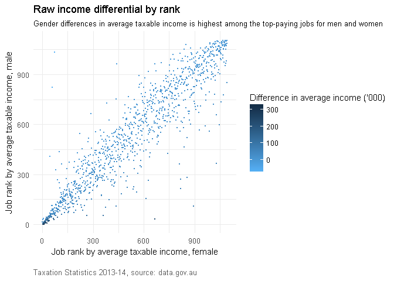
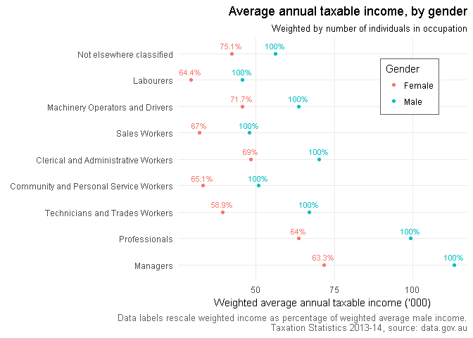

# #TidyTuesday Week 4
Data on Australian taxable income by occupation and gender

## Load the data


```r
library(readr)
library(scales)
library(tidyverse)

week4 <- read_csv("week4_australian_salary.csv")
week4 %>% head(3) %>% knitr::kable(format = 'html')
```

<table>
 <thead>
  <tr>
   <th style="text-align:right;"> X1 </th>
   <th style="text-align:right;"> gender_rank </th>
   <th style="text-align:left;"> occupation </th>
   <th style="text-align:left;"> gender </th>
   <th style="text-align:right;"> individuals </th>
   <th style="text-align:right;"> average_taxable_income </th>
  </tr>
 </thead>
<tbody>
  <tr>
   <td style="text-align:right;"> 1 </td>
   <td style="text-align:right;"> 795 </td>
   <td style="text-align:left;"> Abattoir process worker; Meat process worker; Meatworker 㤼㸶 meatworker㤼㸲s labourer </td>
   <td style="text-align:left;"> Female </td>
   <td style="text-align:right;"> 5961 </td>
   <td style="text-align:right;"> 36359 </td>
  </tr>
  <tr>
   <td style="text-align:right;"> 2 </td>
   <td style="text-align:right;"> 881 </td>
   <td style="text-align:left;"> Abattoir process worker; Meat process worker; Meatworker 㤼㸶 meatworker㤼㸲s labourer </td>
   <td style="text-align:left;"> Male </td>
   <td style="text-align:right;"> 17241 </td>
   <td style="text-align:right;"> 40954 </td>
  </tr>
  <tr>
   <td style="text-align:right;"> 3 </td>
   <td style="text-align:right;"> 699 </td>
   <td style="text-align:left;"> Aboriginal and Torres Strait Islander education worker </td>
   <td style="text-align:left;"> Female </td>
   <td style="text-align:right;"> 1386 </td>
   <td style="text-align:right;"> 40926 </td>
  </tr>
</tbody>
</table>

## Plot a histogram, using a log-scale to overcome skewness in the distribution 


```r
week4 %>%
  ggplot(aes(x = average_taxable_income, y = ..density.., 
                     fill = gender, weights = individuals)) + 
  geom_histogram() +
  labs(title = "Distribution of average taxable income",
       x = "Average taxable income (log-scaled)", y = 'Density', 
       caption = "Taxation Statistics 2013-14, source: data.gov.au") + 
  scale_x_log10(labels = comma, 
                breaks = c(25000,50000,100000, 150000)) + 
  theme_minimal() + 
  theme(plot.caption = element_text(hjust = 1, color = 'grey38'), 
        legend.position = c(.9,.5), 
        panel.grid.major.y = element_blank(), 
        panel.grid.minor.y = element_blank()) 
```

<!-- -->

## Reshaping the data to wide


```r
reshape(as.data.frame(week4), idvar='occupation',
        timevar='gender',direction='wide') -> week4shape 

week4shape$diff <- week4shape$average_taxable_income.Male -
  week4shape$average_taxable_income.Female
```

## The highest-earning jobs (by gender) have the greatest income differentials
The raw income differential is the difference between the average taxable income of males and females by occupation. 


```r
ggplot(data = week4shape, aes(gender_rank.Female, gender_rank.Male, 
                              color = diff/1000)) + geom_jitter(size = .1) +
  labs(title = 'Raw income differential by rank',
       subtitle = 'Gender differences in average taxable income is highest among the top-paying jobs for men and women', 
       x = 'Job rank by average taxable income, female', 
       y = 'Job rank by average taxable income, male', 
       caption = "Taxation Statistics 2013-14, source: data.gov.au") + 
  theme_minimal() + 
  theme(plot.caption = element_text(hjust = 7.3, color = 'grey38')) + 
  scale_color_continuous(name = "Difference in average income ('000)", 
                          labels = comma, high = "#132B43", low = "#56B1F7")
```

<!-- -->

## Another way of visualising the distribution of income 

* Plot female income as percentage of male income against raw income differential. 

* Does the proportion of female workers matter? [@WireMonkey](https://twitter.com/WireMonkey/status/988856291480276993?s=19)


```r
week4shape$index = week4shape$average_taxable_income.Female/week4shape$average_taxable_income.Male * 100
week4shape$propfemale = week4shape$individuals.Female/(week4shape$individuals.Female + week4shape$individuals.Male)

ggplot(data = week4shape, aes(index, diff/1000, color = propfemale)) + geom_point(size = 1) + 
  labs(title = 'Distribution of income differences', 
       subtitle = 'In almost all jobs, men have higher average taxable income than women', 
       x = "Female average income as percentage of male income", 
       y = "Female income - male income ('000)",
       caption = "Taxation Statistics 2013-14, source: data.gov.au") +
  theme_minimal() + theme(plot.caption = element_text(hjust = 0, 
                                                      color = 'grey38'), 
                          legend.position = c(.7,.7), 
                          legend.background = element_rect(fill = 'white', 
                                                           color = 'grey38')) +
  scale_x_continuous(labels = function(x) paste0(x, "%")) + 
  scale_colour_continuous(name = "Proportion of females in occupation", 
                          high = "#132B43", low = "#56B1F7") 
```

<!-- -->

## Back to source data 
In the source dataset, ANZSCO occupational codes can be obtained for classification


```r
library(readxl)
tax <- read_excel("taxstats2014individual14occupationgendertaxableincome.xlsx", 
                  sheet = "Individual Table 14B", range = "A3:D2212")
tax %>% head(3) %>% knitr::kable(format = 'html')
```

<table>
 <thead>
  <tr>
   <th style="text-align:left;"> Occupation1 </th>
   <th style="text-align:left;"> Gender </th>
   <th style="text-align:right;"> Individuals
no. </th>
   <th style="text-align:right;"> Average taxable income
$ </th>
  </tr>
 </thead>
<tbody>
  <tr>
   <td style="text-align:left;"> 111111 Chief executive officer; Executive director; Managing director; Public servant – secretary or deputy secretary </td>
   <td style="text-align:left;"> Female </td>
   <td style="text-align:right;"> 41895 </td>
   <td style="text-align:right;"> 116854.9 </td>
  </tr>
  <tr>
   <td style="text-align:left;"> 111111 Chief executive officer; Executive director; Managing director; Public servant – secretary or deputy secretary </td>
   <td style="text-align:left;"> Male </td>
   <td style="text-align:right;"> 111813 </td>
   <td style="text-align:right;"> 181849.0 </td>
  </tr>
  <tr>
   <td style="text-align:left;"> 111211 Corporate general manager </td>
   <td style="text-align:left;"> Female </td>
   <td style="text-align:right;"> 68481 </td>
   <td style="text-align:right;"> 79406.0 </td>
  </tr>
</tbody>
</table>

where the first six characters of the variable Occupation1 are the ANZSCO codes. 


```r
tax$OccCode <- substring(tax$Occupation1, 1, 6) # occupational codes
tax$TopCode <- substring(tax$Occupation1, 1, 1) # top-level occupational code

tax2 <- tax[tax$TopCode!='N', ] # Not listed or unknown - removed

# convert to factor
factor(tax2$TopCode, ordered = TRUE, levels = c(1,2,3,4,5,6,7,8,9), 
       labels = c('Managers', 'Professionals', 
                  'Technicians and Trades Workers', 
                  'Community and Personal Service Workers', 
                  'Clerical and Administrative Workers', 
                  'Sales Workers', 'Machinery Operators and Drivers', 
                  'Labourers', 
                  'Not elsewhere classified')) -> tax2$FactorTopcode
```

# Beeswarm plots 
* Although not ideal to show distributions, I thought beeswarm plots would be good to show differences in the gender composition of job classes across different levels of taxable income 
* A log scale is used to pull in extreme observations, as [suggested by @a40ruhr](https://twitter.com/a40ruhr/status/988880737238577153?s=20). 
* Note that this is a distribution of gender-occupation combinations! 


```r
# rounding for nicer beeswarms
tax2$income <- round(tax2$`Average taxable income\r\n$`, -4)

# copied function for scientific formatting of axes ticks 
fancy_scientific <- function(l) {
     # turn in to character string in scientific notation
     l <- format(l, scientific = TRUE)
     # quote the part before the exponent to keep all the digits
     l <- gsub("^(.*)e", "'\\1'e", l)
     # turn the 'e+' into plotmath format
     l <- gsub("e", "%*%10^", l)
     # return this as an expression
     parse(text=l)
}

library(ggbeeswarm)
ggplot(tax2, aes(FactorTopcode, income, color = Gender)) +
  geom_beeswarm(cex = .11, shape = 15, size = 1) + coord_flip() +
  theme_minimal() + 
  theme(plot.title = element_text(hjust = 0.5),
        plot.subtitle = element_text(hjust = 0.5),
        panel.grid.major.y = element_blank(), 
        panel.grid.minor = element_blank(), 
        plot.caption = element_text(hjust = 0.5, color = 'grey38'), 
        legend.position = 'right') + 
  scale_y_continuous(trans = 'log10', labels=fancy_scientific) + 
  labs(title = "Distribution of occupations by average taxable income", 
         subtitle = "Males occupy the top-paying jobs in most job categories", 
         y = "Average annual taxable income ('000 AUD)", x = element_blank(), 
       caption = "\nTaxation Statistics 2013-14, source: data.gov.au")
```

<!-- -->

# Gender-occuption combinations don't mean much ... 
* not unless they're weighted by the number of people in that occupation. 
* Weighted average of income by occupation class is calculated 
* Also [weighted average income as percentage of male income](https://twitter.com/a40ruhr/status/988880995079274498?s=20) 


```r
# calculating weighted income
tax2$`Average taxable income\r\n$`*tax2$`Individuals\r\nno.` -> tax2$weightinc

# calculating weighted average female income as proportion of weighted average male income 

tax2 %>% 
  group_by(FactorTopcode, Gender) %>% 
  summarise(inc = sum(weightinc, na.rm = TRUE), 
            weights = sum(`Individuals\r\nno.`, na.rm = TRUE)) -> tax3

tax3 %>% mutate(deweightinc = inc/weights) %>% 
  select(-inc, -weights) %>% spread(Gender, deweightinc) %>% 
  mutate(prop = Female/Male*100) -> tax3a

tax3a %>% merge(tax3, by = 'FactorTopcode') -> tax3a
tax3a[tax3a$Gender=='Male', 'prop'] = 100
```


```r
tax3a %>% 
  ggplot(aes(x = inc/weights/10e2, y = FactorTopcode, color = Gender)) + 
  geom_point() + 
  theme_minimal() + geom_text(aes(label = paste0(round(prop,1),'%')), 
                              nudge_y = 0.3, show.legend= FALSE, 
                              size = 3) + 
  labs(x = "Average annual taxable income ('000)", y = element_blank(), 
       title = "Weighed average annual taxable income, by gender", 
       subtitle = "Weighted by number of individuals in occupation",
       caption = "Data labels rescale weighted income as percentage of weighted average male income.\n Taxation Statistics 2013-14, source: data.gov.au") + 
  theme(plot.title = element_text(hjust = 1), 
        plot.subtitle = element_text(hjust = 1), 
        legend.position = c(.8,.8), 
        legend.background = element_rect(fill = 'white', color = 'grey38'),
        plot.caption = element_text(hjust = 1, color = 'grey38'), 
        panel.grid.minor.x = element_blank())
```

<!-- -->
