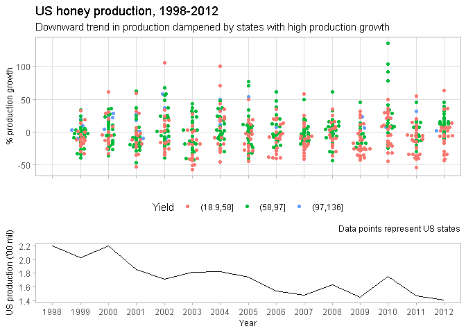

```r
setwd("~/tidy/week8_honey_production")

library(tidyverse)
library(plm)
library(ggbeeswarm)
library(patchwork)

honey <- read_csv('honeyproduction.csv')
```

```r
# convert honey to a panel data frame
pdata.frame(honey, index = c('state', 'year')) -> honey 
# compute growth rates using diff and lag functions
diff(honey$totalprod)/lag(honey$totalprod,1) -> growth

as.data.frame(growth) %>% 
  mutate(
    state = row.names(.) %>% substr(1,2),
    # isolate state and year from rownames to separate columns
    year = row.names(.) %>% substr(4,7),
    # assign yields to three bins, to identify high- medium- and low-yield states
    yieldcut = cut(honey$yieldpercol, 3)) -> growthdf


ggplot(growthdf, aes(x = year, y = round(growth*100, 1), color = yieldcut)) +
  geom_beeswarm() + theme_light() + 
  labs(title = "US honey production, 1998-2012", 
       subtitle = "Downward trend in production dampened by states with high production growth", 
       caption = 'Data points represent US states', 
       y = '% production growth', x = element_blank() , color = 'Yield') + 
  theme( panel.grid.minor = element_blank(), 
         axis.text.x = element_blank(), axis.title.y = element_text(size =9),
        legend.position = 'bottom') -> p1

honey %>% 
  group_by(year) %>% 
  summarise(honeysum = sum(totalprod)) %>% 
  ggplot(aes(x = year, y = honeysum/1e8, group = 1)) + geom_line() + theme_light() + 
  # not sure why specifying group = 1 works - it just does 
  theme(panel.grid.major = element_blank(), panel.grid.minor = element_blank(), 
        axis.title.y = element_text(size = 9), axis.title.x = element_text(size = 9)) + 
  labs(y = "US production (\'00 mil)", x = "Year") -> p2

p1 + p2 + plot_layout(ncol = 1, heights = c(.7, .3)) # join p1 and p2 
```

```
## Warning: Removed 44 rows containing missing values (position_beeswarm).
```

<!-- -->

