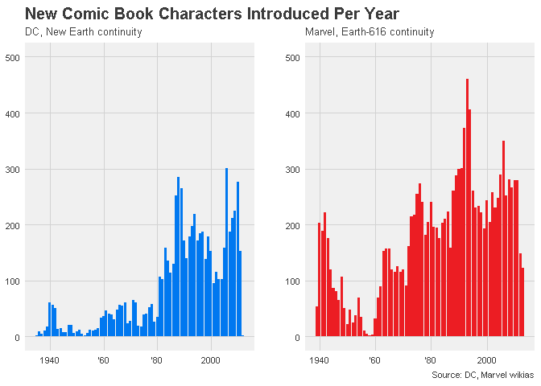
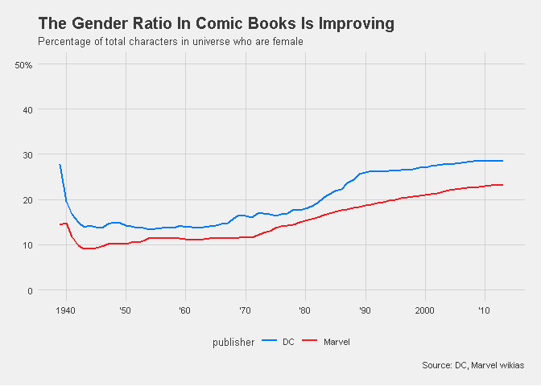
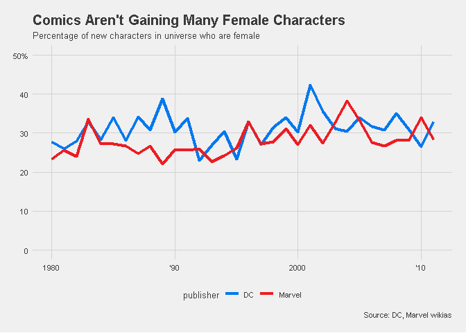

```r
library(readr) 
library(magrittr) # pipes
library(dplyr)
library(ggplot2)
library(tidyr)
library(patchwork) # glue plots together
library(stringr)
library(ggthemes)

characters <- read_csv("week9_comic_characters.csv")
```


```r
# plot 1 
# extract continuities within brackets
characters %>% 
  mutate(continuity = str_extract(.$name, "(?<=\\().*?(?=\\))")) -> char2

# to reuse ggplot2 elements across both plots
gglist<- list(scale_y_continuous(limits = c(0,500), breaks = 0:5*100),
              scale_x_continuous(breaks = 97:100*20,
                                 labels = c('1940', '\'60', '\'80', '2000')),
              theme_fivethirtyeight(10))  

# generate barplots for # characters by year for specified continuities
char2 %>% 
  filter(publisher == 'DC' & continuity == 'New Earth') %>% 
  ggplot(aes(year)) + geom_bar(fill= '#0078F0') + 
  labs(title = "New Comic Book Characters Introduced Per Year", 
       subtitle = "DC, New Earth continuity") + gglist   -> p1

char2 %>% 
  filter(publisher == 'Marvel' & continuity == 'Earth-616') %>% 
  ggplot(aes(year)) + geom_bar(fill= '#EC1D23') + 
  labs(subtitle = "Marvel, Earth-616 continuity", 
       caption = "Source: DC, Marvel wikias") + gglist -> p2

p1 + p2 + plot_layout(ncol = 2) 
```

```
## Warning: Removed 67 rows containing non-finite values (stat_count).
```

```
## Warning: Removed 657 rows containing non-finite values (stat_count).
```

<!-- -->

```r
# plot 2 
# specify colors for DC and Marvel plots
group.colors <- c(DC = "#0078F0", Marvel = "#EC1D23")

gglist2 <- list(scale_y_continuous(breaks = 0:5*10, 
                                   labels = c('0', '10', '20', '30', '40', '50%'), 
                                   limits = c(0,50)), 
                scale_color_manual(values = group.colors),
                theme_fivethirtyeight(10))

characters %>% 
  # create logical T if female, F if not 
  mutate(female = .$sex == 'Female Characters') %>%  
  # obtain no. of females, total characters by publisher-year 
  group_by(publisher, year) %>% 
  summarise(females = sum(female, na.rm = T), nchars = n()) %>%
  # replace NA values with 0
  replace_na(list(females = 0))  %>% 
  # to facilitate cumsum so that cumulative sum calculated by publisher
  ungroup %>% group_by(publisher) %>%
  # exclude obs earlier than 1938
  filter(year > 1938) %>% 
  # calculate cum. sum of females and sex ratio over time by publisher
  mutate(anotherfemales = cumsum(females), 
         sexratio = cumsum(females)/cumsum(nchars)*100) %>% 
  ggplot(aes(x = year, y = sexratio, col = publisher)) + 
  geom_line(size = 1) + gglist2 + 
  theme(panel.grid.minor = element_blank()) + 
  scale_x_continuous(breaks = 194:201*10, 
                     labels = c('1940', '\'50', '\'60', '\'70', 
                                '\'80', '\'90', '2000', '\'10')) + 
  labs(title = "The Gender Ratio In Comic Books Is Improving",
       subtitle = "Percentage of total characters in universe who are female",
       caption = "Source: DC, Marvel wikias", 
       x = "", y = "")
```

<!-- -->

```r
# plot 3 
characters %>% 
  mutate(female = .$sex == 'Female Characters')%>%
  # calculate sex ratio of newly introduced characters
  group_by(year, publisher) %>% 
  summarise(sexratio = sum(female, na.rm = T)/n()) %>%
  # exclude observations earlier than 1979, later than 2012
  filter(year > 1979 & year < 2012) %>% 
  ggplot(aes(x = year, y = sexratio*100, col = publisher)) +  
  geom_line(size = 1.5) + gglist2 + 
  scale_x_continuous(breaks = 198:201*10, 
                     labels = c('1980', '\'90', '2000', '\'10')) + 
  labs(title = "Comics Aren't Gaining Many Female Characters",
       subtitle = "Percentage of new characters in universe who are female",
       caption = "Source: DC, Marvel wikias", 
       x = "", y = "") 
```

<!-- -->

