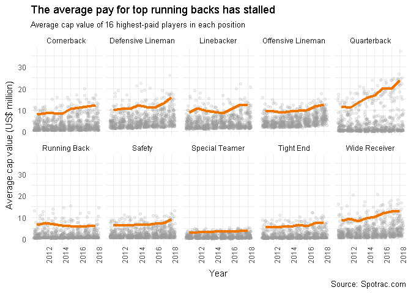

#  #TidyTuesday Week 2

```r
library(tidyverse) 
library(readxl)

week2 <- read_excel("C:/Users/Philip/Downloads/tidy_tuesday_week2.xlsx")

week2a <- plyr::rename(week2, c('Cornerback' = 'pay.CB', 'Defensive Lineman' = 'pay.DL', 
                                'Linebacker' = 'pay.LB', 'Offensive Lineman' = 'pay.LN', 
                                'Quarterback' = 'pay.QB', 'Running Back' = 'pay.RB', 
                                'Safety' = 'pay.S', 'Special Teamer' = 'pay.ST', 
                                'Tight End' = 'pay.TE', 'Wide Receiver' = 'pay.WR'))

week2shape <- reshape(data=as.data.frame(week2a), 
                      varying = c('pay.CB', 'pay.DL', 'pay.LB', 'pay.LN', 'pay.QB', 'pay.RB', 
                                  'pay.S', 'pay.ST', 'pay.TE', 'pay.WR'), 
                      direction = 'long', timevar = 'player')

week2shape$pay.av <- ave(week2shape$pay, week2shape$player, week2shape$year, 
                         FUN = function(x) mean(head(sort(x, decreasing = TRUE), 16), na.rm = TRUE))

week2shape$offense <- grepl('RB|QB|LN|TE|WR', week2shape$player)*1

week2shape$player <- factor(x = week2shape$player, 
                             labels  = c('CB' = 'Cornerback', 'DL' = 'Defensive Lineman', 
                                         'LB' = 'Linebacker', 'LN' = 'Offensive Lineman', 
                                         'QB' = 'Quarterback', 'RB' = 'Running Back', 
                                         'S' = 'Safety', 'ST' = 'Special Teamer',
                                         'TE' = 'Tight End', 'WR' = 'Wide Receiver'))
```


```r
ggplot(data = week2shape) + 
  geom_jitter(aes(x = year, y= pay/(10^6), alpha = pay), color = '#999999') + 
  geom_line(aes(x = year, y = pay.av/(10^6)), color = '#ee7600', size = 1.5) + 
  scale_alpha(range = c(0.2, 0.1)) + facet_wrap(~player,nrow = 2) + 
  theme_minimal() + 
  labs(title = 'The average pay for top running backs has stalled',
       subtitle = 'Average cap value of 16 highest-paid players in each position', 
       caption = 'Source: Spotrac.com', 
       x = 'Year', y = 'Average cap value (US$ million)') + 
  theme(axis.text.x = element_text(angle = 90, hjust = 1), legend.position = 'none') 
```

<!-- -->
